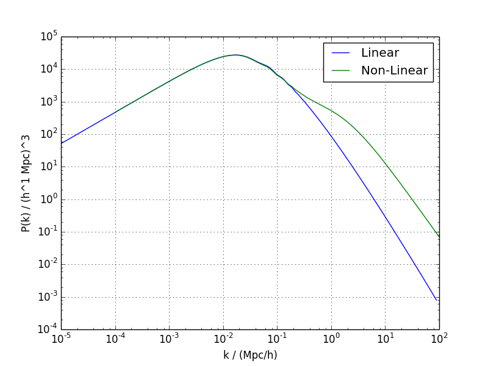

Demo 1:  Running a pipeline on a single model
----------------------------------------------

This demo will calculate standard cosmological distances, and matter and CMB power spectra using the cosmological parameters given in the demos/values1.ini file.

You run CosmoSIS on a parameter file.  That parameter file describes a pipeline that you want to run, and points to another file containing input parameter values to use.

Running
=======

Install and set up cosmosis, then run demo 1::

    cosmosis demos/demo1.ini

You should see some output from the Boltzmann code `CAMB <http://camb.info/>`_.  A directory will now exist called :code:`demo_output_1`, containing basic cosmology data, like CMB spectra, matter power, and cosmological parameters.  You can make plots of these quantities using the cosmosis postprocess command::

    postprocess demos/demo1.ini -o plots -p demo1

You will now have a collection of .png plots in the plots directory showing CMB and matter power spectra, and distances as a function of redshift:

.. code-block:: c

    > ls plots
    README
    demo1_angular_distance.png
    demo1_bb.png
    demo1_comoving_distance.png
    demo1_distance_modulus.png
    demo1_ee.png
    demo1_grand.png
    demo1_hubble.png
    demo1_luminosity_distance.png
    demo1_matter_power.png
    demo1_te.png
    demo1_tt.png

For example, the demo1_matter_power.png should look like this:

Understanding CosmoSIS
======================

CosmoSIS always runs on a parameter file in the :code:`ini` format, which uses section names surrounded by [square brackets] and options with an = siqn.  In this case we use the parameter file :code:`demos/demo1.ini`.  Different sections in the file describe different aspects of the analysis.  It starts with the :code:`runtime` section:

.. code-block:: bash

    [runtime]
    ; The test sampler just runs a single parameter set
    sampler = test

CosmoSIS comes with a range of different samplers to explore your model parameter spaces in different ways.  The :code:`test` sampler just tests the pipeline by running the pipeline on a set of input parameter values.

The next thing to do is to set the options of our sampler. 
When we will use actual sampler we will see more interesting options. Right know our sampler test just receive the results from the modules and save them. 
So we just need to tell it where to do that with:

.. code-block:: ini

    [test]
    ; These are the parameters for this sampler.
    ; In this case there is just one parameter
    save_dir=demo_output_1

As we mentioned earlier CosmoSIS is based on *modules*.  Each module is a single piece of code that does a calculation, taking some inputs from previous modules and saving some outputs for later.

The list of modules is shown in the **pipeline** section:

.. code-block:: ini

    [pipeline]
    ; The list of modules to be run, in this order.
    ; The modules named here must appear as sections below
    modules = consistency camb halofit

We first ran "consistency", a handy module for the start of pipelines that generates the simpler derived parameters, like omega_c from omega_m and omega_b.

We then ran a CAMB module, to do the main cosmology calculations, and a halofit module, to compute non-linear power.  In later demos we will see some other [CosmoSIS modules](modules) we can add here. 

The inputs to the pipeline are some parameters to specify the cosmology.  Those parameters are in the file given by this part of the pipeline section:

.. code-block:: ini

    ; The file to get cosmological and nuisance parameters
    ; from.
    values = demos/values1.ini

This tells cosmosis about another file where the parameters are found.  
**Have a look** in the file *demos/values1.ini*.

Parameters and data in CosmoSIS are organized into sections.  There is only one section in this case, called cosmological_parameters.  And the parameters are specified here, for example like this:

.. code-block:: ini

    omega_m = 0.3
    h0 = 0.72
    omega_b = 0.04

At the moment we are just specifying a single value for each parameter.  Later we will see how to set a range of parameters to be sampled over.

Internally, the CAMB module asked for the values of the parameters that it needed, and they were found from here.  CAMB then computed some things and added them to the collection of saved data, so that the next module, halofit, could look at them too.

Halofit read its input parameters and data and added its own new data, the non-linear power spectrum.

The resulting data are passed to the sampler, in this case test, that just save them.

